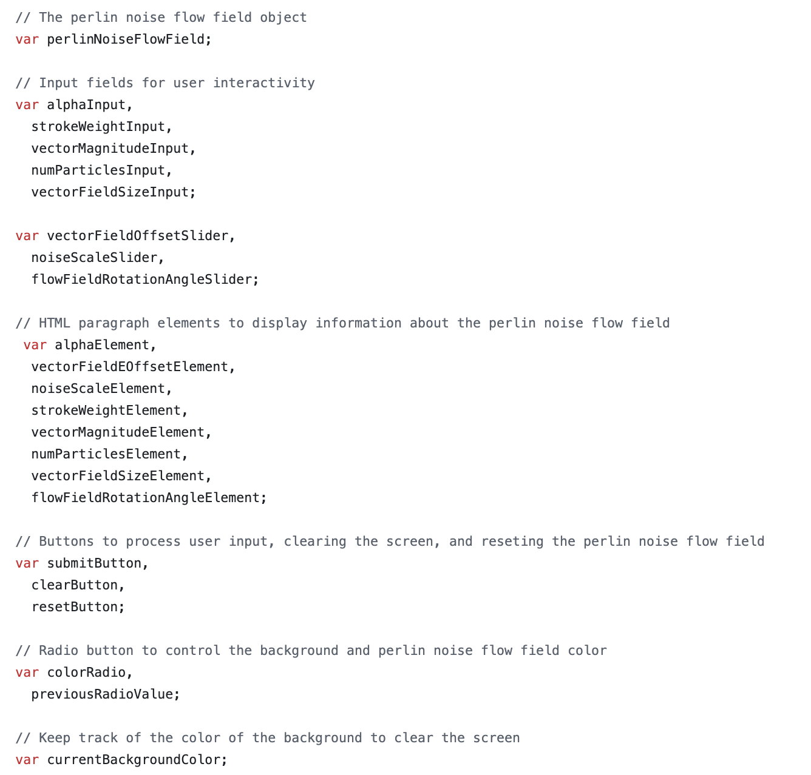

# IDEA1905 Week 08 - Quiz

## Part 1: Imaging Technique Inspiration

I have selected this artwork as I was drawn to the way that the artist has used digital technologies to convey something that is natural. The way they have used the swirling patterns create a strong sense of movement. The organic nature to the shapes helps to convey the organic nature of the artwork. I believe that finding similar techniques to create something organic and paint-like will be useful as some of the artworks for the major project also convey these same organic shapes and paint-like strokes.

## Part 2:Coding Technique Exploration

I believe perlin noise is a function that could be used to create abstract visuals that depict smooth, organic shapes and movement. Even though this artwork is static, I thought it could be interesting to use movement to depict the same style of artwork. The way perlin noise uses continuous movements, rather than static movement, would help to create the more organic shapes.

## Perlin Noise Example 01

## Perlin Noise Code Example 01

## GitHub Code Example Link

https://github.com/Abar23/Perlin-Noise-Flow-Field/blob/master/sketch.js
